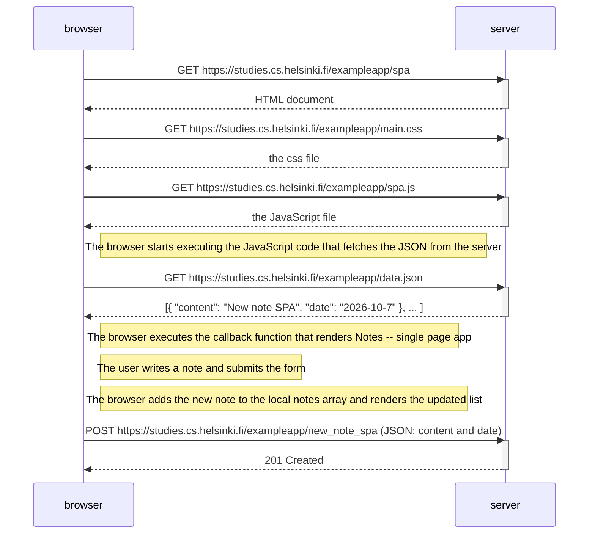

```mermaid
sequenceDiagram
    participant browser
    participant server    

    browser->>server: GET https://studies.cs.helsinki.fi/exampleapp/spa
    activate server
    server-->>browser: HTML document
    deactivate server

    browser->>server: GET https://studies.cs.helsinki.fi/exampleapp/main.css
    activate server
    server-->>browser: the css file
    deactivate server

    browser->>server: GET https://studies.cs.helsinki.fi/exampleapp/spa.js
    activate server
    server-->>browser: the JavaScript file
    deactivate server

    Note right of browser: The browser starts executing the JavaScript code that fetches the JSON from the server

    browser->>server: GET https://studies.cs.helsinki.fi/exampleapp/data.json
    activate server
    server-->>browser: [{ "content": "New note SPA", "date": "2026-10-7" }, ... ]
    deactivate server

    Note right of browser: The browser executes the callback function that renders Notes -- single page app    

    Note right of browser: The user writes a note and submits the form
    Note right of browser: The browser adds the new note to the local notes array and renders the updated list

    browser->>server: POST https://studies.cs.helsinki.fi/exampleapp/new_note_spa (JSON: content and date)
    activate server
    server-->>browser: 201 Created
    deactivate server
```